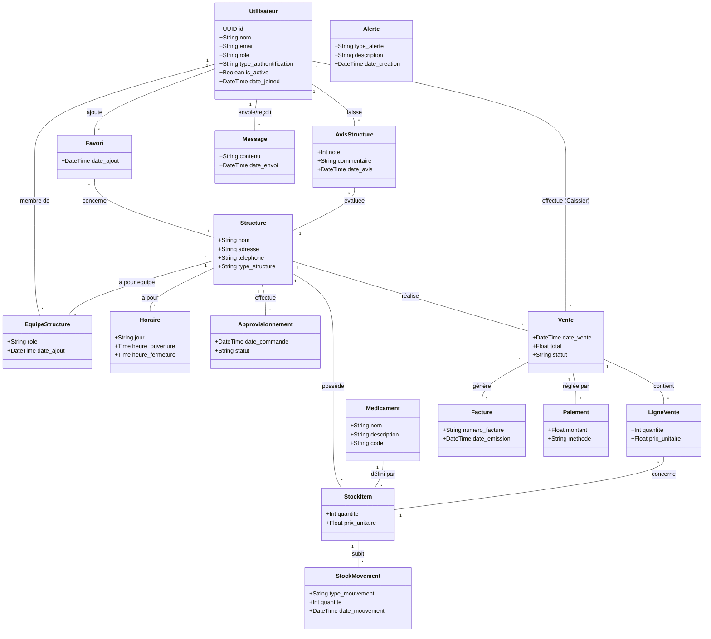

# Cartographie du Projet

Ce document présente la cartographie générale de la plateforme (projet de stage L2). Il inclut l'architecture globale, le diagramme de classes du backend (Django) ainsi que le diagramme de cas d'utilisation, mettant en évidence les interactions des différents acteurs avec le système.

## 1. Vue d'ensemble du Projet

Il s'agit d'une plateforme médicale et pharmaceutique (gestion de structures de santé, pharmacies, cliniques) permettant :
- La gestion des **utilisateurs** avec différents rôles (Administrateur, Propriétaire, Gestionnaire, Caissier, Patient).
- La gestion des **structures** de santé (pharmacies, cliniques, services médicaux).
- La gestion des **ventes et de la caisse** (facturation, paiements, retours).
- La gestion des **stocks et approvisionnements** (médicaments, mouvements de stock, inventaires).
- Les **interactions patients-structures** (avis, prise en charge, messagerie, alertes, recherche).

---

## 2. Diagramme de Classes du Backend

Voici une représentation simplifiée du diagramme de classes du backend, organisé par modules principaux :



---

## 3. Diagramme de Cas d'Utilisation

Ce diagramme illustre les fonctionnalités accessibles selon les rôles des utilisateurs : **Patient**, **Caissier**, **Gestionnaire**, **Propriétaire** et **Administrateur**.

```mermaid
usecaseDiagram
    actor Patient
    actor Caissier
    actor Gestionnaire
    actor Proprietaire
    actor Administrateur

    package "Plateforme Médicale / Pharmacie" {
        %% Cas d'utilisation Patient
        usecase "Rechercher une structure" as UC_Recherche
        usecase "Consulter une structure" as UC_Consulter
        usecase "Laisser un avis" as UC_Avis
        usecase "Demander une prise en charge" as UC_PriseEnCharge
        usecase "Ajouter aux favoris" as UC_Favori

        %% Cas d'utilisation Caissier
        usecase "Effectuer une vente" as UC_Vente
        usecase "Encaisser un paiement" as UC_Paiement
        usecase "Générer une facture" as UC_Facture
        usecase "Gérer un retour de caisse" as UC_Retour

        %% Cas d'utilisation Gestionnaire
        usecase "Gérer les stocks" as UC_Stock
        usecase "Faire un inventaire" as UC_Inventaire
        usecase "Passer un approvisionnement" as UC_Approvisionnement
        usecase "Consulter les alertes" as UC_Alertes

        %% Cas d'utilisation Propriétaire
        usecase "Gérer la structure" as UC_Structure
        usecase "Gérer l'équipe" as UC_Equipe
        usecase "Consulter les statistiques" as UC_Stats

        %% Cas d'utilisation Administrateur
        usecase "Superviser la plateforme" as UC_Supervision
        usecase "Gérer tous les utilisateurs" as UC_AdminUsers
    }

    %% Relations Patient
    Patient --> UC_Recherche
    Patient --> UC_Consulter
    Patient --> UC_Avis
    Patient --> UC_PriseEnCharge
    Patient --> UC_Favori

    %% Relations Caissier
    Caissier --> UC_Vente
    Caissier --> UC_Paiement
    Caissier --> UC_Facture
    Caissier --> UC_Retour

    %% Relations Gestionnaire
    Gestionnaire --> UC_Stock
    Gestionnaire --> UC_Inventaire
    Gestionnaire --> UC_Approvisionnement
    Gestionnaire --> UC_Alertes
    Gestionnaire --> UC_Vente : (Peut aussi vendre)

    %% Relations Propriétaire
    Proprietaire --> UC_Structure
    Proprietaire --> UC_Equipe
    Proprietaire --> UC_Stats
    Proprietaire --> UC_Stock : (Supervise)

    %% Relations Administrateur
    Administrateur --> UC_Supervision
    Administrateur --> UC_AdminUsers
```
