# Cartographie UML - SanteProx

Ce fichier rassemble une cartographie claire du systeme pour le rapport :

1. diagramme de cas d'utilisation global ;
2. diagramme de classes du domaine metier ;
3. diagramme de sequence du moteur de recherche.

Les scripts ci-dessous sont ecrits pour PlantUML.  
Choix de composition :

- `left to right direction` pour une lecture stable ;
- `skinparam linetype ortho` pour garder des traits droits ;
- regroupement par modules metiers pour eviter un diagramme trop dense ;
- les roles `PHARMACIE` et `HOPITAL` partagent la meme base de structure via `Structure.type`.

---

## 1) Diagramme de cas d'utilisation global

```plantuml
@startuml
left to right direction
skinparam shadowing false
skinparam linetype ortho
skinparam packageStyle rectangle
skinparam actorStyle awesome

actor "Visiteur" as Visitor
actor "Utilisateur connecte" as LoggedUser
actor "Patient" as Patient
actor "Proprietaire" as Owner
actor "Gestionnaire" as Manager
actor "Caissier" as Cashier
actor "Administrateur SanteProx" as Admin
actor "Tache systeme" as SystemActor

rectangle "SanteProx" {
  usecase "Creer un compte" as UC_Register
  usecase "Connexion / deconnexion" as UC_Login
  usecase "Recherche publique\nde structures et medicaments" as UC_PublicSearch
  usecase "Voir suggestions" as UC_Suggestions
  usecase "Voir carte et fiche structure" as UC_MapSheet
  usecase "Contacter l'equipe" as UC_Contact
  usecase "Laisser un avis / feedback" as UC_Feedback
  usecase "Consulter et gerer son profil" as UC_Profile
  usecase "Consulter favoris / notifications" as UC_FavNotif

  usecase "Creer et gerer une structure" as UC_Structure
  usecase "Configurer localisation et horaires" as UC_HoursGeo
  usecase "Creer equipe et permissions" as UC_Team
  usecase "Activer / desactiver modules" as UC_Modules
  usecase "Gerer stock et approvisionnement" as UC_Stock
  usecase "Gerer inventaire" as UC_Inventory
  usecase "Gerer ventes / caisse / factures" as UC_Cash
  usecase "Consulter alertes et historique" as UC_Audit
  usecase "Gerer messagerie" as UC_Messages
  usecase "Gerer services medicaux" as UC_Medical
  usecase "Consulter statistiques" as UC_Stats

  usecase "Creer un proprietaire" as UC_CreateOwner
  usecase "Valider / suspendre une structure" as UC_ValidateStructure
  usecase "Superviser utilisateurs et roles" as UC_SuperviseUsers
  usecase "Publier notifications" as UC_Notify
  usecase "Reindexer la recherche" as UC_Reindex
  usecase "Gerer catalogues" as UC_Catalogues

  usecase "Indexer les donnees" as UC_Index
  usecase "Generer alertes automatiques" as UC_AutoAlerts
  usecase "Expirer les ventes" as UC_ExpireSales
  usecase "Envoyer push / email" as UC_PushEmail
}

Visitor --> UC_Register
Visitor --> UC_Login
Visitor --> UC_PublicSearch
Visitor --> UC_Suggestions
Visitor --> UC_MapSheet

Patient --> UC_Contact
Patient --> UC_Feedback
Patient --> UC_Profile
Patient --> UC_FavNotif
Patient --> UC_PublicSearch
Patient --> UC_MapSheet

LoggedUser --> UC_Profile
LoggedUser --> UC_FavNotif
LoggedUser --> UC_Contact
LoggedUser --> UC_Feedback

Owner --> UC_Structure
Owner --> UC_HoursGeo
Owner --> UC_Team
Owner --> UC_Modules
Owner --> UC_Stock
Owner --> UC_Inventory
Owner --> UC_Cash
Owner --> UC_Audit
Owner --> UC_Messages
Owner --> UC_Medical
Owner --> UC_Stats
Owner --> UC_Notify : via notifications

Manager --> UC_Stock
Manager --> UC_Inventory
Manager --> UC_Cash
Manager --> UC_Audit
Manager --> UC_Messages
Manager --> UC_Medical

Cashier --> UC_Cash
Cashier --> UC_Audit
Cashier --> UC_Messages
Cashier --> UC_FavNotif

Admin --> UC_CreateOwner
Admin --> UC_ValidateStructure
Admin --> UC_SuperviseUsers
Admin --> UC_Notify
Admin --> UC_Reindex
Admin --> UC_Catalogues
Admin --> UC_Stats
Admin --> UC_AutoAlerts

SystemActor --> UC_Index
SystemActor --> UC_AutoAlerts
SystemActor --> UC_ExpireSales
SystemActor --> UC_PushEmail

UC_PublicSearch .> UC_Suggestions : <<include>>
UC_PublicSearch .> UC_MapSheet : <<include>>
UC_Contact .> UC_Login : <<extend>>\nsi non connecte
UC_Feedback .> UC_Login : <<extend>>\nsi non connecte
UC_Structure .> UC_HoursGeo : <<include>>
UC_Structure .> UC_Team : <<include>>
UC_Team .> UC_Modules : <<include>>
UC_Stock .> UC_Audit : <<include>>
UC_Cash .> UC_Audit : <<include>>
UC_Reindex .> UC_Index : <<include>>

note right of UC_Structure
  Le type de structure est PHARMACIE
  ou HOPITAL selon Structure.type.
end note

note bottom of UC_Team
  Les permissions fines sont stockees
  via EquipeStructure + MembrePermission.
end note
@enduml
```



---

## 2) Diagramme de classes du systeme

```plantuml
@startuml
left to right direction
skinparam shadowing false
skinparam linetype ortho
skinparam packageStyle rectangle
skinparam classAttributeIconSize 0

package "Utilisateurs" {
  class Utilisateur {
    +UUID id
    +string nom
    +string email
    +RoleUtilisateur role
    +TypeAuthentification type_authentification
    +bool email_verifie
    +bool is_active
    +bool is_staff
    +datetime date_joined
  }

  enum RoleUtilisateur {
    ADMINISTRATEUR
    PROPRIETAIRE
    GESTIONNAIRE
    CAISSIER
    PATIENT
  }

  enum TypeAuthentification {
    EMAIL
    GOOGLE
  }
}

package "Structures" {
  class Structure {
    +UUID id
    +string nom
    +TypeStructure type
    +string adresse
    +string telephone
    +decimal latitude
    +decimal longitude
    +StatutStructure statut
  }

  enum TypeStructure {
    HOPITAL
    PHARMACIE
  }

  enum StatutStructure {
    EN_ATTENTE
    ACTIVE
    SUSPENDUE
    REFUSEE
  }

  class EquipeStructure {
    +UUID id
    +string role
    +StatutEquipeStructure statut
    +datetime date_invitation
    +datetime date_activation
  }

  enum StatutEquipeStructure {
    INVITE
    ACTIF
    SUSPENDU
  }

  class MembrePermission {
    +UUID id
    +string module
    +string action
  }

  class StructureService {
    +UUID id
    +string nom
    +TypeService type
    +string description
    +string slug
    +bool est_actif
  }

  enum TypeService {
    MALADIE
    ANALYSE
    EXAMEN
    SERVICE_MEDICAL
  }

  class Favori {
    +UUID id
    +datetime date_ajout
  }

  class Horaire {
    +UUID id
    +string jour
    +time heure_ouverture
    +time heure_fermeture
    +bool est_ferme
    +int position
  }

  enum JourSemaine {
    LUNDI
    MARDI
    MERCREDI
    JEUDI
    VENDREDI
    SAMEDI
    DIMANCHE
  }
}

package "Vue metier" {
  class Hopital <<conceptuel>> {
    +type = HOPITAL
  }

  class Pharmacie <<conceptuel>> {
    +type = PHARMACIE
  }
}

package "Stock" {
  class StockItem {
    +UUID id
    +string nom
    +string nom_normalise
    +string type_item
    +int quantite
    +int quantite_reservee
    +bool disponible
    +datetime date_ajout
  }

  class StockMovement {
    +UUID id
    +string type_mouvement
    +int quantite
    +string motif
    +datetime created_at
  }

  class Medicament {
    +UUID id
    +string nom
    +string forme_pharmaceutique
    +decimal prix_vente
    +bool tva
    +bool en_reserve
  }

  class Approvisionnement {
    +UUID id
    +date date_reception
    +string numero
    +string fournisseur
    +decimal montant_total_declare
    +datetime cree_le
  }

  class LigneApprovisionnement {
    +UUID id
    +string forme_pharmaceutique
    +int stock_avant
    +int quantite
    +decimal prix_achat
    +decimal prix_vente
    +date date_peremption
  }

  enum FormePharmaceutique {
    COMPRIME
    CAPSULE
    GELULE
    SIROP
    SOLUTION_BUVABLE
    INJECTABLE
    CREME
    POMMADE
    GEL
    SPRAY
    COLLYRE
    SACHET
    AMPOULE
    SUPPOSITOIRE
    AUTRE
  }
}

package "Ventes" {
  class Vente {
    +UUID id
    +string numero
    +EtatVente etat
    +datetime cree_le
    +datetime transmise_le
    +datetime validee_le
    +datetime annulee_le
    +string nom_client
    +string telephone_client
    +decimal montant_total
    +int nb_articles
  }

  class LigneVente {
    +UUID id
    +string designation
    +string forme_pharmaceutique
    +decimal prix_unitaire
    +int quantite
    +decimal montant
  }

  class Paiement {
    +UUID id
    +string mode
    +decimal montant
    +datetime effectue_le
  }

  class Facture {
    +UUID id
    +string numero
    +string beneficiaire
    +decimal montant_total
    +int nb_articles
    +datetime cree_le
  }

  class ImpressionFacture {
    +UUID id
    +datetime imprime_le
  }

  class RetourCaisse {
    +UUID id
    +string numero
    +string motif
    +string commentaire
    +datetime effectue_le
    +decimal montant_total
    +int nb_articles
  }

  class RetourCaisseLigne {
    +UUID id
    +string designation
    +decimal prix_unitaire
    +int quantite
    +decimal montant
  }

  class OperationCaisse {
    +UUID id
    +string role
    +string action
    +string resultat
    +string detail
    +string adresse_ip
    +datetime cree_le
  }

  enum EtatVente {
    EN_PREPARATION
    EN_ATTENTE_PAIEMENT
    EN_COURS
    PAYEE
    ANNULEE
    EXPIREE
  }

  enum ModePaiement {
    ESPECES
    CARTE
    MOBILE_MONEY
    VIREMENT
    CHEQUE
  }

  enum MotifRetour {
    CLIENT_SANS_ARGENT
    PRODUIT_RETIRE
    ERREUR_QUANTITE
    ERREUR_PRIX
    RETOUR_ACCEPTE
    PRODUIT_DEFECTUEUX
    AUTRE
  }
}

package "Alertes et notifications" {
  class Alerte {
    +UUID id
    +string categorie
    +string type
    +string priorite
    +string module
    +string titre
    +string description
    +bool est_resolue
    +datetime cree_le
  }

  enum CategorieAlerte {
    OPERATIONNELLE
    SUPERVISION
  }

  enum PrioriteAlerte {
    CRITIQUE
    MOYENNE
    INFORMATION
  }

  enum TypeAlerte {
    STOCK_FAIBLE
    RUPTURE_STOCK
    RETOURS_CAISSE_ANORMAUX
    VENTES_ANNULEES_ANORMALES
  }

  enum ModuleAlerte {
    APPROVISIONNEMENT
    STOCK
    VENTE
    CAISSE
    INVENTAIRE
  }

  class Notification {
    +UUID id
    +string titre
    +string message
    +string type
    +string nav_item
    +bool est_lue
    +datetime date_creation
  }

  class PushSubscription {
    +UUID id
    +string endpoint
    +string p256dh
    +string auth
    +bool est_active
    +datetime date_creation
    +datetime date_maj
  }
}

package "Communication et traces" {
  class Conversation {
    +UUID id
    +datetime created_at
    +datetime updated_at
  }

  class Message {
    +UUID id
    +string contenu
    +bool is_read
    +bool est_supprime
    +datetime created_at
  }

  class Feedback {
    +UUID id
    +string type
    +int note
    +string commentaire
    +string sujet
    +string categorie
    +string statut
    +datetime created_at
  }

  class AvisStructure {
    +UUID id
    +int note
    +datetime created_at
  }

  class CommentaireAvis {
    +UUID id
    +string contenu
    +datetime created_at
    +datetime updated_at
  }

  class EvenementHistorique {
    +UUID id
    +string type
    +string role
    +datetime cree_le
    +json donnees
    +string texte_recherche
  }
}

package "Medical et services" {
  class ServiceMedical {
    +UUID id
    +bool actif
    +datetime date_ajout
  }

  class PlateauTechnique {
    +UUID id
    +bool disponible
    +datetime date_ajout
  }

  class PriseEnCharge {
    +UUID id
    +string niveau
    +datetime date_ajout
  }
}

package "Recherche" {
  class SearchLog {
    +UUID id
    +string query
    +decimal user_lat
    +decimal user_lon
    +int results_count
    +string search_type
    +datetime created_at
  }

  class SearchIndex {
    +UUID id
    +string content
    +string content_original
    +string search_type
    +UUID content_type
    +UUID object_id
    +UUID structure_id
    +string structure_nom
    +string structure_type
    +string structure_adresse
    +string structure_telephone
    +decimal structure_latitude
    +decimal structure_longitude
    +bool is_available
    +int quantity
    +json metadata
    +datetime created_at
    +datetime updated_at
  }

  class SearchSynonym {
    +UUID id
    +string term
    +json synonyms
    +string category
    +bool is_active
    +datetime created_at
  }

  class IntentPattern {
    +UUID id
    +string pattern
    +string intent_type
    +string target_search_type
    +int priority
    +bool is_active
  }
}

package "Catalogues" {
  class Catalogue {
    +UUID id
    +string nom
    +string type
    +string description
    +bool est_actif
    +datetime date_creation
    +datetime date_modification
  }

  enum TypeCatalogue {
    MALADIE
    ANALYSE
    EXAMEN
    SERVICE_MEDICAL
  }
}

' -----------------------------------------------------------------
' Relations principales
' -----------------------------------------------------------------

Structure "1" -- "0..1" Utilisateur : gestionnaire
Structure "1" -- "*" EquipeStructure
EquipeStructure "*" -- "1" Utilisateur
EquipeStructure "1" -- "*" MembrePermission

Structure "1" -- "*" Horaire
Structure "1" -- "*" Favori
Favori "*" -- "1" Utilisateur

Structure "1" -- "*" StockItem
StockItem "1" -- "*" StockMovement
StockMovement "*" -- "0..1" Approvisionnement

Structure "1" -- "*" Medicament
Approvisionnement "1" -- "*" LigneApprovisionnement
Approvisionnement "*" -- "1" Structure
Approvisionnement "*" -- "1" Utilisateur : cree_par
LigneApprovisionnement "*" -- "1" Medicament

Structure "1" -- "*" Vente
Vente "*" -- "1" Utilisateur : prepare_par
Vente "*" -- "0..1" Utilisateur : annulee_par
Vente "1" -- "*" LigneVente
LigneVente "*" -- "1" Medicament
Vente "1" -- "1" Paiement
Paiement "*" -- "1" Utilisateur : encaisse_par
Facture "*" -- "1" Structure
Facture "1" -- "1" Vente
Facture "1" -- "1" Paiement
Facture "1" -- "*" ImpressionFacture
ImpressionFacture "*" -- "1" Utilisateur : imprime_par

Structure "1" -- "*" RetourCaisse
RetourCaisse "*" -- "1" Vente
RetourCaisse "*" -- "1" Utilisateur : effectue_par
RetourCaisse "1" -- "*" RetourCaisseLigne
RetourCaisseLigne "*" -- "1" Medicament

Structure "1" -- "*" OperationCaisse
OperationCaisse "*" -- "1" Utilisateur
OperationCaisse "*" -- "0..1" Vente

Structure "1" -- "*" Alerte
Alerte "*" -- "0..1" Utilisateur : utilisateur_concerne
Alerte "*" -- "*" Utilisateur : lu_par

Utilisateur "1" -- "*" Notification
Notification "*" -- "0..1" Structure
Utilisateur "1" -- "*" PushSubscription

Conversation "*" -- "0..1" Structure
Conversation "1" -- "*" Message
Message "*" -- "1" Utilisateur : expediteur

Utilisateur "1" -- "*" Feedback
Feedback "*" -- "0..1" Structure

Utilisateur "1" -- "*" AvisStructure
AvisStructure "*" -- "1" Structure
AvisStructure "1" -- "*" CommentaireAvis

Structure "1" -- "*" ServiceMedical
ServiceMedical "*" -- "0..1" StructureService

Structure "1" -- "*" PlateauTechnique
PlateauTechnique "*" -- "0..1" StructureService

Structure "1" -- "*" PriseEnCharge
PriseEnCharge "*" -- "0..1" StructureService

Utilisateur "1" -- "*" SearchLog
SearchIndex ..> StockItem : indexe
SearchIndex ..> Medicament : indexe
SearchIndex ..> Structure : indexe
SearchIndex ..> StructureService : indexe

SearchSynonym ..> SearchIndex : enrichit
IntentPattern ..> SearchIndex : oriente

Hopital ..> Structure : realise via type
Pharmacie ..> Structure : realise via type
Hopital ..> ServiceMedical : exploite
Hopital ..> PlateauTechnique : exploite
Hopital ..> PriseEnCharge : exploite
Hopital ..> Conversation : communication
Hopital ..> Notification : alerte / info
Hopital ..> SearchIndex : expose au moteur

note right of Structure
  Une structure peut representer
  une pharmacie ou un hopital.
  La logique metier du projet
  decide quels modules sont visibles.
end note

note bottom of MembrePermission
  Le module dynamique repose sur :
  equipe + module + action.
  C'est la base des visibilites
  et permissions fines.
end note
@enduml
```



---

## 3) Diagramme de sequence du moteur de recherche public

```plantuml
@startuml
autonumber
left to right direction
skinparam shadowing false
skinparam linetype ortho
title Sequence du moteur de recherche public SanteProx

actor "Utilisateur" as U
participant "SearchBar\n(frontend)" as SearchBar
participant "useSuggestions()\n(frontend)" as SuggestionsHook
participant "useSearch()\n(frontend)" as SearchHook
participant "axios" as Axios
participant "PublicPharmacySearchView\n(API Django)" as API
participant "PublicPharmacySearchEngine" as Engine
participant "StockService" as StockService
participant "HoraireService" as HoraireService
database "Base de donnees" as DB
participant "Store de recherche\n(Zustand)" as Store
participant "Sidebar / Carte" as UI

U -> SearchBar : saisit un texte
activate SearchBar
alt champ de recherche vide
  SearchBar -> SearchHook : query vide
  SearchHook -> Axios : GET /api/search/public/pharmacies/?q=&lat=...&lon=...
  activate SearchHook
  Axios -> API : requete HTTP
  activate API
  API -> Engine : search(query="", user_lat, user_lon, page, page_size)
  activate Engine
  Engine -> StockService : produits_publics_globaux(recherche="")
  StockService -> DB : lecture stocks / medicaments / approvisionnements
  DB --> StockService : candidats
  StockService --> Engine : candidats
  Engine -> HoraireService : est_ouverte(structure, horaires)
  HoraireService -> DB : lecture des horaires de Structure
  DB --> HoraireService : horaires
  HoraireService --> Engine : structures ouvertes
  Engine -> Engine : calcule distance, temps,\npagination et map_results
  Engine --> API : resultat structure
  API --> SearchHook : JSON results + map_results
  SearchHook -> Store : setResults(...)
  Store -> UI : afficher les structures proches
  UI --> U : resultat visible
  deactivate Engine
  deactivate API
  deactivate SearchHook
else champ de recherche saisi
  SearchBar -> SuggestionsHook : requete de suggestions
  SuggestionsHook -> Axios : GET /api/search/public/suggestions/?q=...
  activate SuggestionsHook
  Axios -> API : requete HTTP
  activate API
  API -> Engine : suggestions(query)
  activate Engine
  Engine -> StockService : suggestions_medicaments(query)
  StockService -> DB : lecture des medicaments / stocks
  DB --> StockService : resultats
  StockService --> Engine : suggestions
  Engine --> API : JSON suggestions
  API --> SuggestionsHook : suggestions
  SuggestionsHook --> SearchBar : liste des suggestions
  deactivate Engine
  deactivate API
  deactivate SuggestionsHook

  SearchBar -> SearchHook : useSearch({ query, page })
  SearchHook -> Axios : GET /api/search/public/pharmacies/?q=...&lat=...&lon=...
  activate SearchHook
  Axios -> API : requete HTTP
  activate API
  API -> Engine : search(query, user_lat, user_lon, page, page_size)
  activate Engine
  Engine -> StockService : produits_publics_globaux(recherche=query)
  StockService -> DB : lecture stocks / medicaments / approvisionnements
  DB --> StockService : candidats
  StockService --> Engine : candidats
  Engine -> HoraireService : est_ouverte(structure, horaires)
  HoraireService -> DB : lecture des horaires de Structure
  DB --> HoraireService : horaires
  HoraireService --> Engine : structures ouvertes
  Engine -> Engine : calcule distance, temps,\npagination et map_results
  Engine --> API : resultat structure
  API --> SearchHook : JSON results + map_results
  SearchHook -> Store : setResults(...) ou appendResults(...)
  Store -> UI : re-render sidebar / carte
  UI --> U : structures affichees
  deactivate Engine
  deactivate API
  deactivate SearchHook
end
deactivate SearchBar

note right of Engine
  La source de verite est le serveur :
  stocks reels, horaires officiels,
  structures actives, localisation.
end note
@enduml
```

---

## 4) Lecture rapide pour le rapport

- `Utilisateur` porte les roles metiers : `ADMINISTRATEUR`, `PROPRIETAIRE`, `GESTIONNAIRE`, `CAISSIER`, `PATIENT`.
- `Structure` represente indifferemment une pharmacie ou un hopital via `TypeStructure`.
- `EquipeStructure` + `MembrePermission` pilotent les membres, les modules visibles et les droits fins.
- `Stock`, `Ventes`, `Alertes`, `Historique`, `Notifications` et `Messagerie` sont relies a `Structure` et a `Utilisateur`.
- Le moteur de recherche public est centre sur `StockService`, `Structure`, `HoraireService` et les coordonnees geographiques.

Ce fichier peut etre copié tel quel dans un rendu PlantUML ou dans un outil
Markdown qui prend en charge PlantUML.
